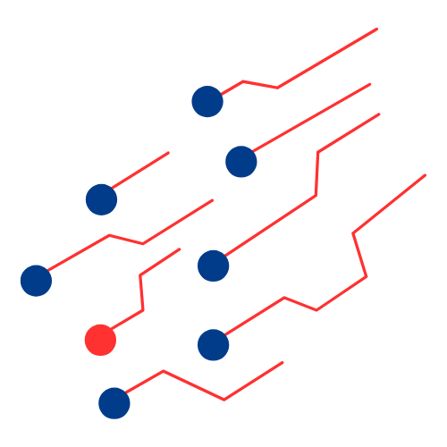

   

    
API and Cloud Integration Framework

    

[![Badge License]][License]   [![Badge Likes]][#]

<i class="fa-brands fa-google-drive" style="font-size: 25px;"></i>  <i class="fa-solid fa-cloud" style="font-size: 25px;"></i>    <i class="fa-brands fa-aws" style="font-size: 25px;"></i>

    
Increasingly, cloud environments and APIs are growing more frequent, both in terms of efficiency and technological innovation. However, we need to enhance ways to ensure better security for data traffic in an increasingly connected world. 
    <h2>SkyChain</h2>
    This framework was developed as part of a graduate program in software engineering.

<!-- gif com codigo -->

    

    
 ● Analyze the most commonly used security practices by large companies. 
    ● Develop an easy-to-use and practical security framework for small businesses. 
    ● Create a design pattern for API integration solutions and cloud environments.

Thus, the framework will allow for the adoption of security practices with accessible and effective techniques to mitigate risks, being scalable and flexible for enhancements.

    

    <h5>Solutions</h5>
    

 ● Simplified Authentication and Authorization: Implement OAuth 2.0 using external authentication providers (Google or Auth0) to simplify the integration process and ensure secure access. 

     ● Role-Based Access Control: Define basic roles (Admin, Regular User) and manage access through RBAC using free or low-cost tools. 

     ● Data Encryption with TLS: Use free TLS certificates (such as Let’s Encrypt) to ensure that traffic between APIs and users is encrypted. 

     ● Basic Monitoring and Security Alerts: Utilize free tools like Graylog or Elastic Stack for monitoring and log collection. Basic alerts can be configured to detect unusual activities. 

    ● Firewall and DDoS Protection: Implement an API firewall based on solutions like Cloudflare, which offers basic and free DDoS protection, limiting access by IP and time if necessary.

 Skychain can be a crucial solution for any organization that relies on cloud APIs, ensuring robust and affordable security. This not only protects data and system integrity, but also provides a solid foundation for continued growth and innovation.

    <h5>Install</h5>
    
<code>git clone https://github.com/matheussbrand/skychain.git</code>

    
<code>cd skychain</code>

    
<code>pip install -r requirements.txt</code>

<!-- inserir link -->
<a href="https://www.youtube.com" target="_blank">
    <i class="fa-brands fa-youtube"></i> Check out the video (available only in Brazilian Portuguese)
</a>

<!---------------------------------------------------------------------------->

[Button Shield]: https://img.shields.io/badge/Shield_Buttons-37a779?style=for-the-badge

[License]: LICENSE
[Shield]: Types/Shield.md
[KBD]: Types/KBD.md
[#]: #

<!---------------------------------[ Badges ]---------------------------------->

[Badge License]: https://img.shields.io/badge/-BY_SA_4.0-ae6c18.svg?style=for-the-badge&labelColor=EF9421&logoColor=white&logo=CreativeCommons
[Badge Likes]: https://img.shields.io/github/stars/MarkedDown/Buttons?style=for-the-badge&labelColor=d0ab23&color=b0901e&logoColor=white&logo=Trustpilot

<!--  -->
